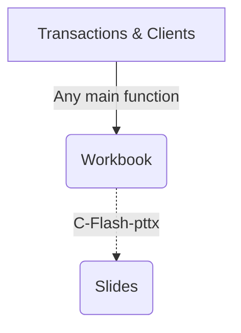

# c-flash-data-analysis

Retail data analysis package. This package export workbook excel and can generate slide thanks to c-flash-pptx

<div class="center">


</div>

## Installation

```bash
pip3 install git+ssh://git@gitlab.com/tools-cways/c-flash-data-analysis.git@master#egg=c-flash-data-analysis 
```

## Needs

[Needs](./docs/needs.md)

## How to use ?

- [Project architecture](./docs/architecture.md)
- [Understand the common logic](./docs/common-usage.md)

## Functionalities

- [Age impact](./docs/functionalities/age_impact.md)
- [Business equation](./docs/functionalities/business-equation.md)
- Clients flux :
  - [Churn rate](./docs/functionalities/churn-rate.md)
  - [Client movement waterfall](./docs/functionalities/client-movement-waterfall.md)
  - [Recruit/retain departments](./docs/functionalities/recruit-retain-departments.md)
- [Cross sell matrix](./docs/functionalities/cross-sell-matrix.md)
- First visits :
  - [First visit basket](./docs/functionalities/first-visit-basket.md)
  - [Department flux on first visits](./docs/functionalities/first-visit-department-flux.md)
  - [Interpurchase delay between firt visits](./docs/functionalities/interpurchase-delay.md)
- [Frequency impact](./docs/functionalities/frequency-impact.md)
- [Mono Multi](./docs/functionalities/mono-multi.md)
- [Monograph](./docs/functionalities/monograph.md)
- [PMG](./docs/functionalities/pmg.md)
- [Purchase time](./docs/functionalities/purchase-time.md)
- [Top product](./docs/functionalities/top-product.md)
  
## Issues & contact

Please, use the **Issue** section from gitlab to report any bugs, progress points.

<u>xavier.lai@c-ways.com</u>

<body>
 <pre><code class="language-mermaid">graph LR
A--&gt;B
</code></pre>

<div class="mermaid">graph LR
A--&gt;B
</div>
	
</body>
<script>
var config = {
    startOnLoad:true,
    theme: 'forest',
    flowchart:{
            useMaxWidth:false,
            htmlLabels:true
        }
};
mermaid.initialize(config);
window.mermaid.init(undefined, document.querySelectorAll('.language-mermaid'));
</script>