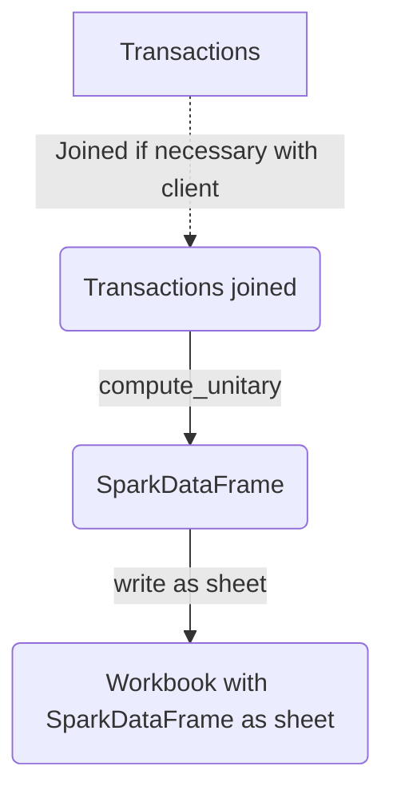

# Common logic

## Common process

Many main function have the same data pre-process. In fact Inputs are either transactions spark dataframe either clients or both.
Usually the function pre-process by joining transactions and clients in order to add clients features.
Then a compute_unitary function will be trigger on this joined input and will allow analysis by pivot features (next section)

<div class="center">



</div>

## Pivot features (Group by)

Every main function allow analysis on multiple axis thanks to the argument **cols_to_gpby_params_list**. In fact, the compute_unitary function will run on every combination of this argument.

Example:

```python
cols_to_gpby_params_list=[None, ["canal"], ["classe_age", "lbl_secteur"]]
```

This setup will compute on 3 axis :
1. **Global** (`None`)
2. By **Canal**
3. By **classe_age x lbl_secteur**

**Every gpby features must be a List (Except `None`)**

In most functions default pivot features have been set. One just need to set `add_default_cols_to_gpby=True` to add those default features to the analysis.

## Perimeter

The perimeter is defined by the inputs. Sometimes the function requires both inputs N and N-1, other times the function requires no precision.

There are two main ways to generate workbook:
- Generate on one year
- Generate on two year and compute growth between

These two ways are coded in `common/excel_export/generic_main_application.py`.

Main functions use those ways to create workbooks on different perimeter on every combination of pivot features.

## Common indicators

Indicators that are needed for many functions are coded in `commo/indicators_computation/`. For example the function `compute_client_kpis` compute main kpi's for each client (`id_client`). Those functions can be imported and use independently

