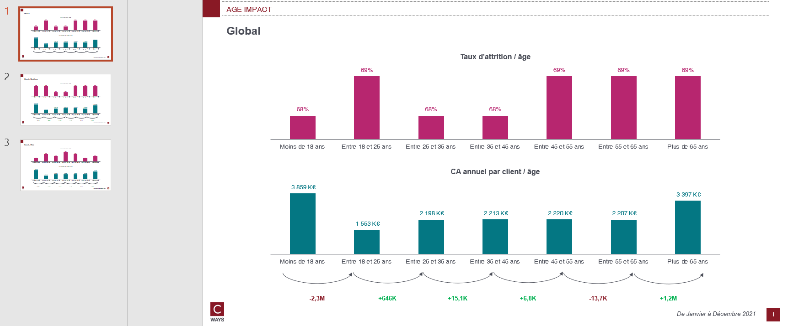

# Age impact

## Needs

- transactions N
- transactions N-1
- clients all perimeter

`classe_age` must be present in clients sparkdataframe.

## Goal

* Which age class is the most loyal and has the most value in sales ?
* Which age class represents an important turning point (valuable or not) ?
...

By each age class, this function will compute :
- Business equation N, N-1 and growth
- Churn rate N


## How to run ?

```python
export_age_impact(
    transactions_n_sdf,
    transactions_n_1_sdf,
    clients_sdf,
    "outputs/age-impact-gpby.xlsx",
    cols_to_gpby_params_list=[["canal"]],
    export_pptx=True,
    pptx_output_file_name=None,
)
```

It will compute age impact on `global` and `canal` and build the workbook. Then it will export slides in same directory of workbook (because no file name is specified).

## Workbook expectation

The worbook will have multiple sheets. Each sheets are prefixed with type of computation :
- eq: business equation
- churn: churn rate

If the computation is on combination of features the sheet will be suffixed with this combination.

## Slide expectation

There will be as many slides as there are modalities of combination features. For example in our case there are two modalities in canal ["WEB", "BOUTIQUE"]. So there will be 3 slides. 1 for global perimeter, 1 for WEB, 1 for BOUTIQUE.


