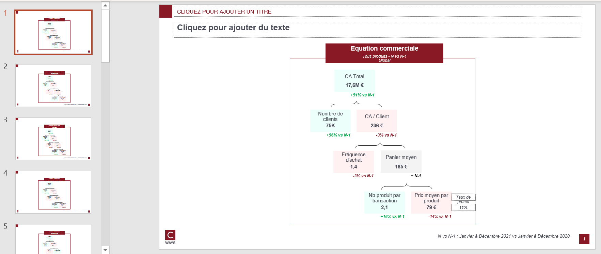

# Business equation

## Needs

- transactions N
- transactions N-1
- clients N
- clients N-1

Transactions should contains those features : `canal`, `lbl_secteur`
Clients should contain `classe_age`

Becareful : `canal` in  ["BOUTIQUE", "WEB"]

## Goal

One can answer those questions on as many client population that one want :

* What is the financial situation ?
* What are the financial client behaviors ?
* Have there been major changes in behaviour vs N-1 ?

By each pivot feature combination, this function will compute :
- Business equation N, N-1 and growth

## Definitions

* **ca_client**: sum of mnt_net_ttc (can make the sum of positive and negative numbers)
* **qte_client**: sum of qte (can make the sum of positive and negative numbers)
* **mnt_remise_client**: sum of mnt_remise
* **Active customer** : A customer is active when he visit at least one time with a value > 0€

## How to run ?

```python
export_business_equation(
    transactions_n,
    transactions_n_1,
    clients_n,
    clients_n_1,
    "outputs/business-equation-gpby.xlsx",
    cols_to_gpby_params_list=None,
    add_default_cols_to_gpby=True,
    export_pptx=True,
    pptx_output_file_name=None
)
```

Because `add_default_cols_to_gpby=True`, business equation will be computed on `global`, by `canal`, `lbl_secteur`, `classe_age` and `profil_client_canal` ( this feature is computed automatically with `canal`)

## Workbook expectation

The worbook will have multiple sheets. Each sheets are prefixed with type of computation :
- eq : business equation
- eq growth: growth between N vs N-1

If the computation is on combination of features the sheet will be suffixed with this combination.

## Slide expectation

There will be as many slides as there are modalities of combination features.

