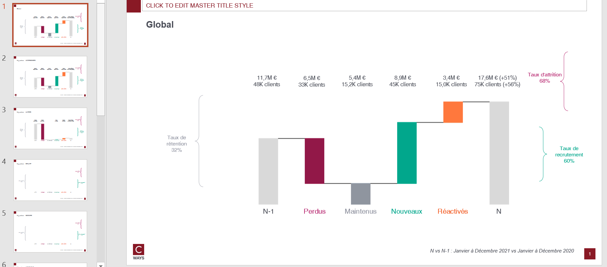

# Client movement waterfall

## Needs

- transactions N
- transactions N-1
- clients all perimeter

Transactions should contains those features : `lbl_secteur`

## Goal

One can answer those questions on as many client population that one want:

* What are the customer flux between N-1 and N ?
* What are the value flux between N-1 and N ?
* Does the recruitment of the brand counterbalance the attrition ?

By each pivot feature combination, this function will compute :
- Business equation N and N-1 by all types of activity customer (MAINTENU/NOUVEAU..)
- churn/retention/attrition rates

## Definitions

[Customer activity definitions](./churn-rate.md)

## How to run ?

```python
export_waterfall(
    transactions_n,
    transactions_n_1,
    clients,
    "outputs/client-movement-waterfall-gpby.xlsx",
    cols_to_gpby_params_list=None,
    add_default_cols_to_gpby=True,
    export_pptx=True,
)
```

Because `add_default_cols_to_gpby=True`, client movement will be computed on `global` and by `lbl_secteur`.

## Workbook expectation

The workbook will have multiple sheets. Each sheets are prefixed with type of computation :
- eq : business equation
- eq growth: growth between N vs N-1
- churn : churn/retention/attrition rates and customer count

If the computation is on combination of features the sheet will be suffixed with this combination.

## Slide expectation

There will be as many slides as there are modalities of combination features.

