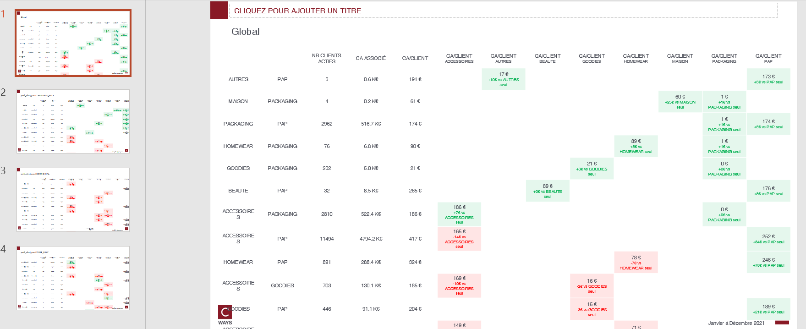

# Cross sell departments

## Needs

- transactions N
- transactions N-1

Transactions should contains those features : `lbl_secteur`.

## Goal

One can answer those questions on as many client population that one want :

* Which departments are most mixed together ?
* Which departments create more values when mixed together vs when exclusive buying ?

By each pivot feature combination, this function will compute :
- Cross sell matrix by every combination
- KPI's of customer who buy only one department

## Definitions

* **Cross seller** : A customer is a cross-seller if he purchase on at least two departments (ignore returns)
* **Exclusive customer** : A customer is exclusive when he only buy one department

## How to run ?

```python
export_cross_sell_department_matrix(
    transactions_n,
    transactions_n_1,
    "outputs/cross-sell-matrix-gpby.xlsx",
    department_col="lbl_secteur",
    clients_n=clients_n,
    clients_n_1=clients_n_1,
    cols_to_gpby_params_list=[None, ["profil_client_canal"]],
    export_pptx=True,
    pptx_output_file_name=None,
    optional_output_dir_intermediate_excel=None,
)
```

If `optional_output_dir_intermediate_excel` is set, the functions will write intermediate workbook that are necessary for slide building

## Workbook expectation

The worbook will have multiple sheets. Each sheets are prefixed with type of computation :
- cross sell : cross sell matrix
- cross sell growth : growth between N vs N-1
- exclusif : kpi's of customer who are exclusive (only buy on one department)
- exclusif_growth : growth between N vs N-1

If the computation is on combination of features the sheet will be suffixed with this combination.

## Slide expectation

There will be as many slides as there are modalities of combination features.

<strong>The table is full and the consultant can adjust what rows he wants to keep.</strong>


