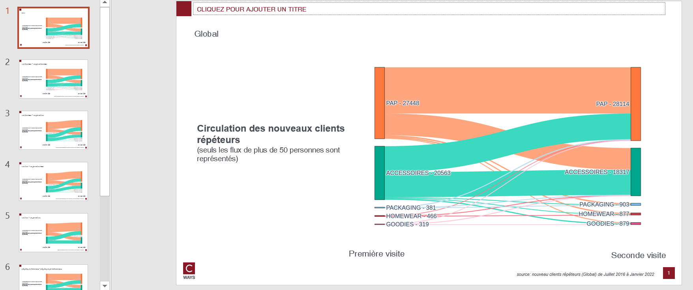

# First visit department flux

## Needs

- transactions (whatever perimeter)
- clients all perimeter

Clients must contain `date_adhesion`

## Goal

One can answer those questions on as many client population that one want:

* What are the flux between departments on first visits ?

By each pivot feature combination, this function will compute :
- Count of client on each combination flux

## Definitions


* **first two visits** : first two visits of a customer

## How to run ?

```python
export_first_visit_department_flux(
    transactions,
    clients,
    "outputs/first-visit-department-flux-gpby.xlsx",
    cols_to_gpby_params_list=[None, ["canal"], ["profil_client_canal"]],
    export_pptx=True,
)
```

Count of client will be computed on `global` and by `canal`, `profil_client_canal` (this feature is computed automatically with `canal`).

## Workbook expectation

The worbook will have multiple sheets. Each sheets are prefixed with type of computation :
- premiers secteurs : customer count on each combination of departments's first two visits 

If the computation is on combination of features the sheet will be suffixed with this combination.

## Slide expectation

There will be as many slides as there are modalities of combination features.



Besides, plots <strong>will be persit in directory of output in html format</strong> if the consultant want to analyse it.
