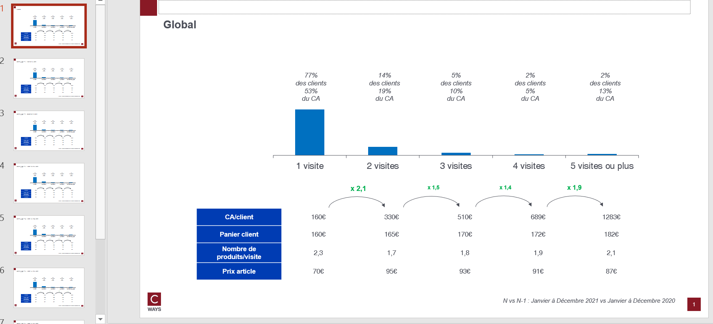

# Frequency impact

## Needs

- transactions N
- transactions N-1

Optional (if one want pivot feature from client df)
- clients N
- clients N-1

## Goal

One can answer those questions on as many client population that one want :

* The share of one timer ?
* What is the value to push a customer to repeat a purchase ?

By each visit class, this function will compute :
- Business equation N, N-1 and growth

## Definitions

* **visit** : visit when a customer purchase for a value > 0€ on a day
* **visit class** : Set in args or by default the visit class thresholds are

```python
DEFAULT_VISIT_SEGMENT_THRESHOLD_LIST = [0, 1.01, 2.01, 3.01, 5, float("Inf")]
DEFAULT_VISIT_SEGMENT_LABELS_LIST = [
    "1 visite",
    "2 visites",
    "3 visites",
    "4 visites",
    "5 visites ou plus",
]
```


## How to run ?

```python
export_frequence_impact(
    transactions_n,
    transactions_n_1,
    "outputs/freq-impact-gpby.xlsx",
    clients_n=clients_n,
    clients_n_1=clients_n_1,
    cols_to_gpby_params_list=[None, ["classe_age"]],
    visit_threshold_list=None,
    visit_label_list=None,
    export_pptx=True,
)
```

It will compute frequency impact on `global` and by `classe_age`.

## Workbook expectation

The worbook will have multiple sheets. Each sheets are prefixed with type of computation :
- freq: business equation by visit class
- freq growth: growth N vs N-1

If the computation is on combination of features the sheet will be suffixed with this combination.

## Slide expectation

There will be as many slides as there are modalities of combination features.


