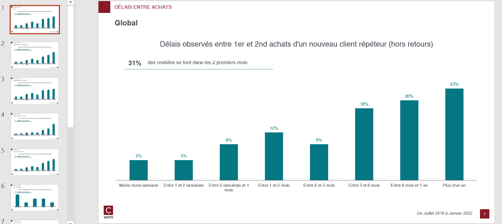

# Interpurchase delay

## Needs

- transactions (whatever perimeter)
- clients all perimeter

Clients must contain `date_adhesion`

## Goal

One can answer those questions on as many client population that one want:

* Which departments are repeating quickly ?
* What are the mean interpurchase delay to repeat on a departments ?

By each pivot feature combination, this function will compute :
- Repartition of customer on delay class

## Definitions


* **delay class** : has been set as constant 

```python
DELAY_LABELS_LIST_DEFAULT = [
    "1 - Moins d'une semaine",
    "2 - Entre 1 et 2 semaines",
    "3 - Entre 2 semaines et 1 mois",
    "4 - Entre 1 et 2 mois",
    "5 - Entre 2 et 3 mois",
    "6 - Entre 3 et 6 mois",
    "7 - Entre 6 mois et 1 an",
    "8 - Plus d'un an",
]
```

* **interpurchase delay** :  delay wait to repeat a purchase. If there is a pivot feature it's the delay wait for repeat on this modalities of feature

For example: If one run with `lbl_secteur` pivot. The interpurchase will be the delay wait to repeat a purchase by department.

## How to run ?

```python
export_interpurchase_delay(
    transactions,
    clients,
    "outputs/interpurchase-delay-gpby.xlsx",
    cols_to_gpby_params_list=[None, ["profil_client_canal"], ["lbl_secteur"]],
    export_pptx=True,
)
```

## Workbook expectation

The worbook will have multiple sheets. Each sheets are prefixed with type of computation :
- délai : customer count and repartition on delay class

If the computation is on combination of features the sheet will be suffixed with this combination.

## Slide expectation

There will be as many slides as there are modalities of combination features.

