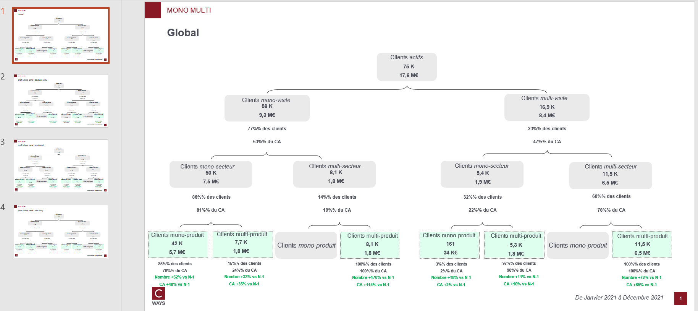

# Mono multi

## Needs

- transactions N
- transactions N-1

Transactions must contains those features : `lbl_produit`, `lbl_secteur`

Optional (if one want pivot feature from client df)
- clients N
- clients N-1

## Goal

One can answer those questions on as many client population that one want :

* What are the financial split repartition for Mono/Multi Visit, Department and product ?
* Have there been major changes vs N-1 ?

By each pivot feature combination, this function will compute :
- Repartition of CA and customer by mono/multi segment

## Definitions


* **visit** : visit when a customer purchase for a value > 0€ on a day
* **Mono Multi segments** : Hierarchical split

```bash
├── mono visit
    ├── mono department
        ├── mono product
        ├── multi product
    ├── multi department
        ├── mono product
        ├── multi product
├── multi visit
    ├── mono department
        ├── mono product
        ├── multi product
    ├── multi department
        ├── mono product
        ├── multi product
```

## How to run ?

```python
export_mono_multi(
    transactions_n,
    transactions_n_1,
    "outputs/mono-multi-gpby.xlsx",
    clients_n=clients_n,
    clients_n_1=clients_n_1,
    cols_to_gpby_params_list=[None, ["profil_client_canal"]],
    export_pptx=True,
)
```

## Workbook expectation

The worbook will have multiple sheets. Each sheets are prefixed with type of computation :
- Mono multi eq : business equation on every combination of 3 segments mono/multi
- Mono multi eq growth : growth N vs N-1

If the computation is on combination of features the sheet will be suffixed with this combination.

## Slide expectation

There will be as many slides as there are modalities of combination features.

