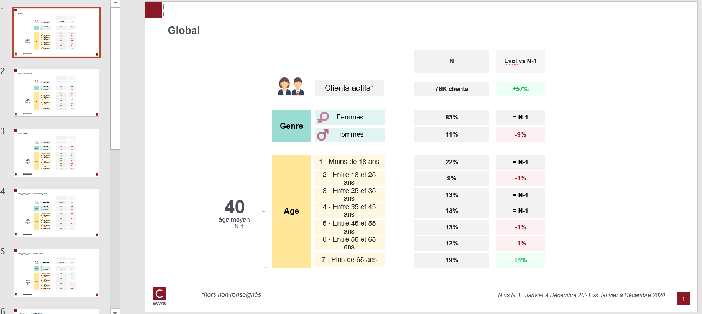

# Monograph

## Needs

- transactions N
- transactions N-1
- clients N
- clients N-1

Client dataframe must contains those features : `civilite`, `classe_age`, `age`.

Transactions should contains those features : `lbl_secteur`, `canal`.

Becareful : `canal`  must be in ["BOUTIQUE", "WEB"].

## Goal

One can answer those questions on as many client population that one want :

* What are the customer profiles of the brand ?
* Have there been major changes in profiles vs N-1 ?

By each pivot features combination, this function will compute :
- Repartition on civilite, classe_age and mean age

## Definitions

[An active customer](./business-equation.md)

## How to run ?

```python
export_monograph(
    transactions_n,
    transactions_n_1,
    clients_n,
    clients_n_1,
    "outputs/monograph-gpby.xlsx",
    cols_to_gpby_params_list=None,
    add_default_cols_to_gpby=True,
    export_pptx=True,
)
```

Because `add_default_cols_to_gpby=True`, business equation will be computed by `canal`, `lbl_secteur` and `profil_client_canal` ( this feature is computed automatically with `canal`)

## Workbook expectation

The worbook will have multiple sheets. Each sheets are prefixed with type of computation :
- civilite repart : repart by male or female
- age repart : repart by age class
- age moyen: mean age

If the computation is on combination of features the sheet will be suffixed with this combination.

## Slide expectation

There will be as many slides as there are modalities of combination features.


