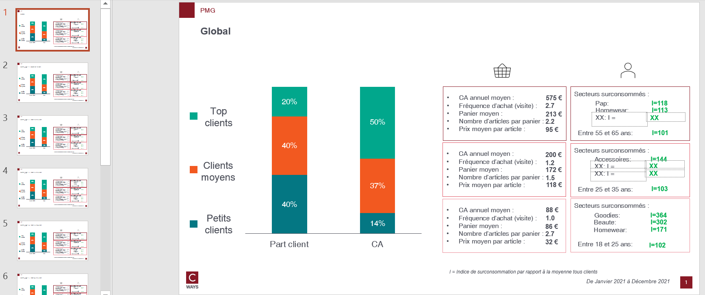

# PMG

## Needs

- transactions N
- transactions N-1
- clients N
- clients N-1


## Goal

One can answer those questions on as many client population that one want :

* I want to know the behavior of my top customers ?
* What is the repartition of CA among my TOP/MID/BOTTOM customers ?
* Which department are over represented among each type of customers ?

By pmg segment and each pivot features combination, this function will compute :
- Business equation N, N-1 and growth
- Over representation of departments

## Definitions

Threshold percentiles can be changed as arguments. Here's the default values

```python
PERCENTILE_DEFAULT_THRESHOLDS = [0, 0.2, 0.6, 1]
PMG_LABELS = ["1_TOP_CLIENTS", "2_MID_CLIENTS", "3_BOTTOM_CLIENTS"]
```

* **Top client** : top 20% client by CA
* **Mid client** : between [20;60%[ client by CA
* **Bottom client** : bottom 40% client by CA


## How to run ?

```python
export_pmg(
    transactions_n,
    transactions_n_1,
    clients_n,
    clients_n_1,
    "outputs/pmg-gpby.xlsx",
    percentile_thresholds=None,
    cols_to_gpby_params_list=None,
    add_default_cols_to_gpby=True,
    export_pptx=True,
)
```

Because `add_default_cols_to_gpby=True`, pmg will be computed by `canal`, and `profil_client_canal` (this feature is computed automatically with `canal`)

## Workbook expectation

The worbook will have multiple sheets. Each sheets are prefixed with type of computation :
- pmg eq: business equation by pmg segment
- pmg eq growth: growth N vs N-1
- pmg surepr: over representation of departments by pmg segment

If the computation is on combination of features the sheet will be suffixed with this combination.

## Slide expectation

There will be as many slides as there are modalities of combination features.


