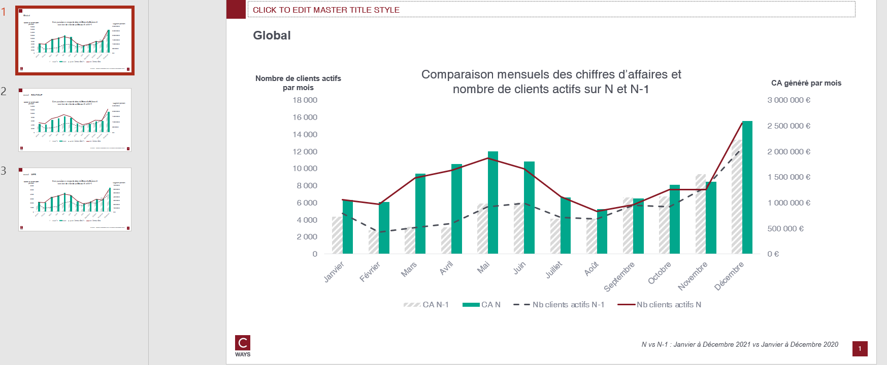

# Purchase time

## Needs

- transactions all perimeter
- transactions N
- transactions N-1

Optional (if one want pivot feature from client df)
- clients all perimeter

## Goal

One can answer those questions on as many client population that one want :

* When the peak of purchase appeared in the year ?
* What is the financial situation thought the year ?
* Have there been major changes in behaviour vs N-1 ?

By each pivot features combination, this function will compute :
- Sum of CA and Customer by each month each year

## Definitions

[An active customer](./business-equation.md)


## How to run ?

```python
export_purchase_time(
    transactions,
    transactions_n,
    transactions_n_1,
    "outputs/purchase-time-gpby.xlsx",
    clients=clients,
    cols_to_gpby_params_list=None,
    add_default_cols_to_gpby=True,
    export_pptx=True,
)
```

Because `add_default_cols_to_gpby=True`, purchase time will be computed on `global` and by `canal`

## Workbook expectation

The worbook will have multiple sheets. Each sheets are prefixed with type of computation :
- purchase time: sum of CA and Customer by each year and month

If the computation is on combination of features the sheet will be suffixed with this combination.

## Slide expectation

There will be as many slides as there are modalities of combination features.


