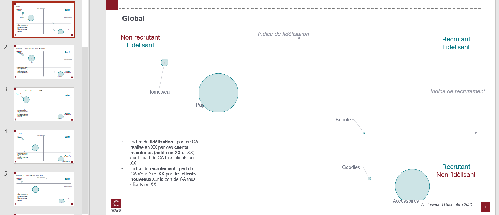

# Recruit retain departments

## Needs

- transactions N
- transactions N-1
- clients all perimeter

Transactions should contains those features : `lbl_secteur` (department col).

client should contains those features : `date_adhesion`.

## Goal

One can answer those questions on as many client population that one want :

* Which departments recruit the most ?
* What are the most loyal departments ?

By each pivot feature combination, this function will compute :
- Over representation of NOUVEAU and MAINTENU N by each departments

## Definitions

[Customer activity definitions](./churn-rate.md)

## How to run ?

```python
export_recruit_retain_department_mapping(
    transactions_n,
    transactions_n_1,
    clients,
    "outputs/recruit-retain-mapping-no-gpby.xlsx",
    clients_n=clients_n, 
    clients_n_1=clients_n_1,
    cols_to_gpby_params_list=[None, ["profil_client_canal"]],
    export_pptx=True,
)
```

Over representation will be computed on `global` and by `profil_client_canal` (feature computed automatically with `canal`).

## Workbook expectation

The workbook will have multiple sheets. Each sheets are prefixed with type of computation :
- secteur : over representation of MAINTENU and NOUVEAU by `lbl_secteur`

If the computation is on combination of features the sheet will be suffixed with this combination.

## Slide expectation

There will be as many slides as there are modalities of combination features.

