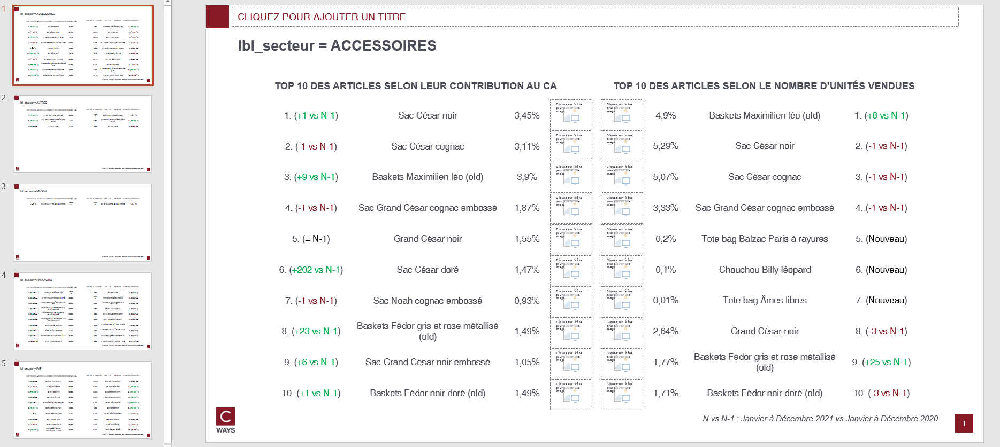

# Top product

## Needs

- transactions N
- transactions N-1

Transactions should contain those features : `lbl_produit`.

Optional (if one want pivot feature from client df)
- clients N
- clients N-1

## Goal

One can answer those questions on as many client population that one want :

* What are the most purchased products ?
* Which products have increased their ranking since last year ?

By each pivot features combination, this function will compute :
- Sum of CA and Customer by each product and the share of CA and customer vs total

## Definitions

* **product** : can be set as argument by default a product is each modality of `lbl_produit`
* **perc_cli** : number of customer who bought a product / number total of customer
* **perc_ca** : ca generated by a product / ca total

## How to run ?

```python
export_top_product(
    transactions_n,
    transactions_n_1,
    "outputs/top-products-gpby.xlsx",
    clients_n=clients_n,
    clients_n_1=clients_n_1,
    cols_to_gpby_params_list=None,
    col_product_id="lbl_produit",
    add_default_cols_to_gpby=False,
    export_pptx=True,
)
```

Because `add_default_cols_to_gpby=True` top product will be computed on `global`, by `canal` and by `lbl_secteur`.

## Workbook expectation

The workbook will have multiple sheets. Each sheets are prefixed with type of computation :
- top product: sum of CA and Customer by each product and share vs total
- top product growth : growth N vs N-1

If the computation is on combination of features the sheet will be suffixed with this combination.

## Slide expectation

There will be as many slides as there are modalities of combination features.



The consultant can upload product's image on each row of the pptx table.
